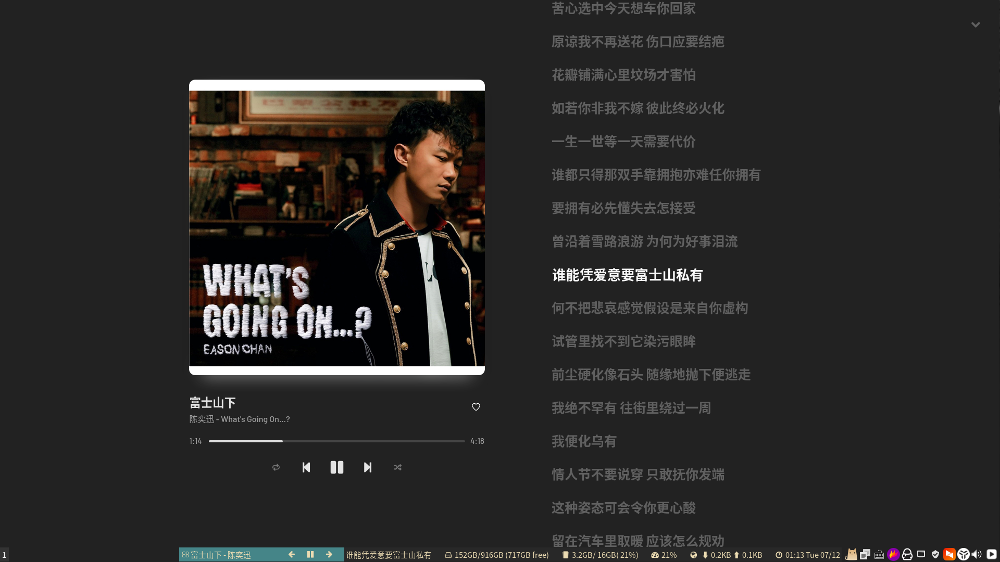

# i3status-rust-ypm-lyrics


在i3status-rust中显示YesPlayMusic的歌词

# 效果截图


# 前置依赖
- YesPlayMusic >= 0.4
- i3status-rust

以Arch为例:

安装YesPlayMusic:
```bash
yay -S yesplaymusic
```

安装i3status-rust:
```bash
yay -S i3status-rust
```

# i3status-rust配置
```bash
sudo vim ~/.config/i3status-rust/config.toml
```

在你觉得合适的位置插入以下内容：

```toml
[[block]]
block = "music"
player = "yesplaymusic"
buttons = ["prev", "play", "next"]

[[block]]
block = "custom"
command = "/usr/bin/i3ypml"
interval = 0.2
```

# 编译

```bash
git clone https://github.com/zzxzzk115/i3status-rust-ypm-lyrics.git
cd i3status-rust-ypm-lyrics/
cargo build --release
sudo cp target/release/i3ypml /usr/bin/
```

# 开发进度

目前是最基本的功能，存在一些问题：

- 存在一定延迟
- 没有考虑鲁棒性
- 歌词字符串没有左右滚动效果
- 没有用缓存来优化
- 没有使用GitHub Actions来进行自动化测试与构建
- 没有发布包到各个平台，目前只能使用Rust Cargo来build release
